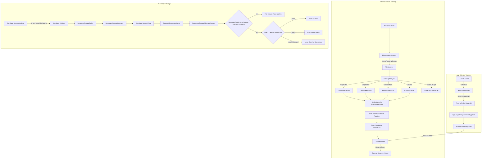

# LittleTidy — Agent & Developer Guide

This document is the authoritative single source of truth for AI agents (and human contributors) working on **LittleTidy**. It is designed so that no agent needs to inspect raw code files to understand the system's architecture, safety rules, data flow, or implementation details.

---

## 1. Project Overview & Mission

**LittleTidy** is a native macOS utility (macOS 26+, Swift 6.2+) designed to inspect, explain, and safely recover disk space hidden within macOS **System Data**, with a specialist focus on **Apple Developer Storage** and conservative general cleanup.

### Primary Problem Solved
macOS Storage Settings aggregates tens or hundreds of gigabytes into an opaque "System Data" category without explaining what is inside or whether it can be safely removed. Generic cleaner apps often treat all developer files as disposable caches, risking build breaks, lost archives, or simulator corruption. LittleTidy provides deep, transparent diagnosis and mechanism-specific cleanup.

### Core Philosophy: "Diagnosis First, Safe Action Second"
1. **Explain Before Cleaning**: Every candidate carries an exact filesystem path, human-readable reason, byte size, confidence level, and operational consequence.
2. **Never Equate Detected Storage with Disposable Storage**: Reclaimable space is strictly segmented into four tiers:
   - `Recommended`: Confidently rebuildable or orphaned data (e.g. DerivedData, unavailable simulator devices). Preselected by default.
   - `Review`: Useful or reinstallable data (e.g. Device Support symbols, old shutdown simulators, local AI model weights). Requires manual review and opt-in.
   - `Protected`: Active or critical assets (e.g. Xcode archives, booted simulators, current runtimes, CoreDevice mounts). Never auto-selected; protected from accidental deletion.
   - `Unclassified`: Data whose ownership or safety cannot yet be proven (e.g. arbitrary XCTest data). Surfaced for diagnostic awareness only; deletion is disabled.
3. **Reversible by Default**: Standard files and directories are moved to the macOS Trash (`FileManager.default.trashItem`) rather than permanently deleted.
4. **Supported Mechanisms Only**: Simulator devices and runtimes are never deleted by directly pruning internal CoreSimulator directories; they are manipulated via Apple's official `xcrun simctl` CLI.
5. **Active-Work Protection (Fail-Closed)**: If Xcode is running, all developer storage cleanup is blocked immediately to prevent corrupting active builds or index databases. If a simulator is booted, it is protected.
6. **Conservative Leftover Matching**: When detecting uninstalled app leftovers, matching is restricted strictly to exact bundle identifier matches (`CFBundleIdentifier`). Shared Group Containers and fuzzy name matches are excluded to prevent cross-app data loss.
7. **Local-First & Private**: Scanning, analysis, and indexing are 100% on-device. No telemetry, file paths, or inventory data leave the user's machine.

---

## 2. Hard Safety Invariants

When modifying or generating code, **never violate these non-negotiable rules**:

| Invariant | Implementation Rule |
|---|---|
| **Trash Over Permanent Delete** | Default deletion mode MUST be `moveToTrash`. Permanent deletion (`removeItem`) is strictly an opt-in toggle guarded in settings. |
| **Simctl For Simulator Management** | Never run `rm -rf` or `FileManager.removeItem` on CoreSimulator devices or runtimes. Use `xcrun simctl delete <UDID>` or `xcrun simctl runtime delete <ID>`. |
| **Simctl State Revalidation** | Simulator state must be re-checked immediately before execution (checking if a device changed to `Booted` since the scan). |
| **Xcode Lock Guard** | Developer cleanup must verify that Xcode is not running (`DeveloperToolActivityChecker`). If Xcode is running or if the check fails, fail-closed and abort. |
| **Duplicate Keep Invariant** | A duplicate group can NEVER have all copies deleted. At least one file MUST be retained (`TrashPlanBuilder.duplicateGroupWouldRemoveAllCopies`). |
| **System Apps Protection** | Any app inside `/System/Applications` or `/System/` is strictly prohibited from cleanup plans. |
| **Symbolic Link Protection** | Symlinks are never traversed or deleted as part of trash plans to prevent escaping approved boundaries. |
| **Approved Roots Boundary** | Every candidate in a general trash plan must reside within user-approved scan roots. |
| **No Group Containers in Leftovers** | Deep app uninstall MUST NEVER touch `~/Library/Group Containers` or use prefix/wildcard search on generic names. Exact bundle IDs only. |
| **CoreDevice Protection** | Mounted device filesystems in `~/Library/Developer/CoreDevice` must never be recursively traversed or cleaned (reported as `bytes: 0`, `protected`). |

---

## 3. Targets & Project Structure

The project uses a hybrid configuration:
- **Swift Package Manager (`Package.swift`)**: Core build and test definition.
- **XcodeGen (`project.yml`)**: Generates `LittleTidy.xcodeproj` for Xcode, code signing, AppKit resources, and packaging.

```
LittleTidy/
├── Package.swift               # SPM definition (LittleTidyCore, LittleTidy, LittleTidyQA, tests)
├── project.yml                 # XcodeGen configuration (bundles, signing, Sparkle, schemes)
├── Sources/
│   ├── LittleTidyCore/         # Pure Swift logic, analyzers, policies, execution (UI-free)
│   ├── LittleTidy/             # SwiftUI + AppKit macOS application
│   └── LittleTidyQA/           # Headless CLI testing harness for QA fixtures
├── Tests/
│   ├── LittleTidyCoreTests/    # Swift Testing suite for LittleTidyCore
│   └── LittleTidyTests/        # Swift Testing suite for Store and UI logic
├── QA/                         # Manual QA checklist & fixture configuration
├── script/                     # Helper build, fixture, and release scripts
├── outputs/                    # Product specs and historical design audits
└── docs/                       # In-depth architectural & domain documentation
```

### Target Responsibilities
1. **`LittleTidyCore`** (Library/Framework): UI-free, dependency-free (except Foundation/CryptoKit/CoreServices). Fully testable from the command line. Contains all scanner logic, analyzers, CLI command clients, policies, and cleanup executors.
2. **`LittleTidy`** (macOS Executable App): SwiftUI app target with AppKit extensions. Depends on `LittleTidyCore` and `Sparkle` (for automatic software updates). Houses the `@MainActor` state stores, sidebar navigation, detail views, and macOS Tahoe-styled UI surfaces.
3. **`LittleTidyQA`** (CLI Tool): Small command-line executable that imports `LittleTidyCore` and runs an end-to-end inventory on synthetic QA fixture folders to verify detection counts and invariants in automated environments.

---

## 4. Comprehensive File Map

### 4.1 `Sources/LittleTidyCore` (Engine & Logic)

#### Models (`Sources/LittleTidyCore/Models/`)
- [`Models.swift`](file:///Users/federicotrevisani/LittleTidy/Sources/LittleTidyCore/Models/Models.swift): Core domain types:
  - `Confidence` (`high`, `medium`, `low`): Confidence in cleanup safety.
  - `CleanupCategory` (`duplicate`, `largeFile`, `unusedApp`, `cache`).
  - `DeletionMode` (`moveToTrash`, `permanentDelete`).
  - `FileRecord`: Metadata snapshot of an indexed file (URL, size, dates, content type, hidden status).
  - `DuplicateGroup`: Set of byte-identical files, content SHA-256, recommended keep file, reclaimable bytes.
  - `LargeFileCandidate`: File exceeding size threshold, scoring explanation, confidence.
  - `RelatedAppData`: URL, size, and category of an app's leftover files (Application Support, Caches, Preferences, etc.).
  - `AppUsageRecord`: App bundle metadata, Spotlight last-opened date, app size, related leftovers.
  - `TrashPlan` & `TrashPlanItem`: Validated batch of files ready for trashing.
- [`DeveloperStorageModels.swift`](file:///Users/federicotrevisani/LittleTidy/Sources/LittleTidyCore/Models/DeveloperStorageModels.swift):
  - `DeveloperStorageCategory` (11 categories: `simulatorDevices`, `simulatorRuntimes`, `xctestDevices`, `derivedData`, `deviceSupport`, `packageCaches`, `aiModelsAndAgents`, `archives`, `androidEmulators`, `testArtifacts`, `otherDeveloperData`).
  - `StorageRecommendation` (`recommended`, `review`, `protected`, `unclassified`).
  - `StorageRecoverability` (`trashRestorable`, `recreatable`, `reinstallable`, `irreversible`, `unknown`).
  - `StorageActivityState` (`active`, `recentlyUsed`, `inactive`, `unavailable`, `unknown`).
  - `DeveloperCleanupMechanism` (`trash`, `simctl`, `xcodeManaged`, `manual`, `unsupported`).
  - `CleanupConsequence` (`negligible`, `temporarySlowdown`, `redownloadRequired`, `debuggingImpact`, `dataLossRisk`, `unknown`).
  - `DeveloperStorageItem`: Single diagnosed developer storage entity.
  - `DeveloperStorageInventory`: Aggregated scan results, access issues, and convenience byte calculators.
- [`AppUninstallEvent.swift`](file:///Users/federicotrevisani/LittleTidy/Sources/LittleTidyCore/Models/AppUninstallEvent.swift): Event payload when an app bundle is trashed, containing app info and detected leftover paths.

#### Policies (`Sources/LittleTidyCore/Policies/`)
- [`DeveloperStoragePolicy.swift`](file:///Users/federicotrevisani/LittleTidy/Sources/LittleTidyCore/Policies/DeveloperStoragePolicy.swift): Pure mapping function from `(DeveloperStorageCategory, isAvailable, isActive)` to `DeveloperStorageDecision`. Encapsulates recommendation rules, recoverability, and consequences.
- [`ScanOptions.swift`](file:///Users/federicotrevisani/LittleTidy/Sources/LittleTidyCore/Policies/ScanOptions.swift): Options controlling scan scope (`includeHiddenFiles`, `includeSystemFolders`, `followSymbolicLinks`, `includeCaches`, thresholds) and stream events (`ScanEvent`, `ScanProgress`, `ScanSummary`).
- [`FullDiskAccess.swift`](file:///Users/federicotrevisani/LittleTidy/Sources/LittleTidyCore/Policies/FullDiskAccess.swift): Probes TCC-protected locations (`~/Library/Safari`, `~/Library/Mail`, `~/Library/Suggestions`) to test whether Full Disk Access is granted, plus settings deep-link URL.

#### Analyzers (`Sources/LittleTidyCore/Analyzers/`)
- [`FileInventoryScanner.swift`](file:///Users/federicotrevisani/LittleTidy/Sources/LittleTidyCore/Analyzers/FileInventoryScanner.swift): Traverses scan roots via `FileManager.DirectoryEnumerator`, filtering excluded/system dirs, checking iCloud ubiquity download state, emitting `AsyncThrowingStream<ScanEvent, Error>`.
- [`DuplicateAnalyzer.swift`](file:///Users/federicotrevisani/LittleTidy/Sources/LittleTidyCore/Analyzers/DuplicateAnalyzer.swift): 3-stage duplicate pipeline:
  1. Group by exact byte size.
  2. Quick 64KB fingerprint (reads head, middle, tail of file; computes SHA-256).
  3. Full SHA-256 chunked hash verification.
  - Keep strategies: `smart` (prefers non-downloads, non-hidden, shallow paths), `oldest`, `newest`, `preferNonDownloads`, `shortestPath`.
- [`LargeFileAnalyzer.swift`](file:///Users/federicotrevisani/LittleTidy/Sources/LittleTidyCore/Analyzers/LargeFileAnalyzer.swift): Evaluates files >= threshold (default 500MB), excludes protected packages (`.photoslibrary`, `.xcodeproj`, `.vmwarevm`), assigns score based on size, age, Downloads location, and extension (`.dmg`, `.pkg`, `.mov`, etc.).
- [`CacheAnalyzer.swift`](file:///Users/federicotrevisani/LittleTidy/Sources/LittleTidyCore/Analyzers/CacheAnalyzer.swift): Locates regenerable caches:
  - Xcode DerivedData (`~/Library/Developer/Xcode/DerivedData`).
  - Standard user caches (`~/Library/Caches/*`).
  - Sandboxed app caches (`~/Library/Containers/*/Data/Library/Caches`).
  - Third-party developer tool caches (`.npm`, `.yarn`, `.cache/pip`, `.cache/uv`, `.cargo`, `pnpm`, `bun`, `gradle`, `conda`, `go`).
  - Maps bundle IDs to human-readable names (`friendlyName`).
- [`AppUsageAnalyzer.swift`](file:///Users/federicotrevisani/LittleTidy/Sources/LittleTidyCore/Analyzers/AppUsageAnalyzer.swift): Scans `/Applications` and `~/Applications`. Reads bundle Info.plist. Fetches last-opened date via Spotlight metadata (`MDItemCreate` / `kMDItemLastUsedDate`), falling back to filesystem dates. Classifies into `probablyUnused` (>=180 days), `possiblyUnused` (>=90 days), `recentlyUsed`. Locates related app data in `~/Library/` by exact bundle identifier.
- [`DeveloperStorageAnalyzer.swift`](file:///Users/federicotrevisani/LittleTidy/Sources/LittleTidyCore/Analyzers/DeveloperStorageAnalyzer.swift): Actor diagnosing Apple and AI developer data:
  - Uses direct `/usr/bin/du -sk` execution for multi-gigabyte CoreSimulator directories (significantly faster than recursive URL enumeration).
  - Uses volume capacity metadata for mounted Simulator runtimes to avoid traversing mounted OS disk images.
  - Invokes `xcrun simctl list --json` and `xcrun simctl runtime list --json`.
  - Analyzes DerivedData, iOS DeviceSupport, Archives, XCTestDevices, Package Caches (SwiftPM, CocoaPods, Carthage), Android AVDs, AI Agents & Models (Ollama, HuggingFace, PyTorch, MLX, LM Studio, Jan, Claude, Cursor, Continue, Gemini).
  - Calculates unallocated CoreSimulator remainder storage.
- [`FolderUsageAnalyzer.swift`](file:///Users/federicotrevisani/LittleTidy/Sources/LittleTidyCore/Analyzers/FolderUsageAnalyzer.swift): Aggregates indexed file records into first-level folders under each scan root for Storage Map treemap visualization without re-traversing the disk.
- [`CleanupAnalysis.swift`](file:///Users/federicotrevisani/LittleTidy/Sources/LittleTidyCore/Analyzers/CleanupAnalysis.swift): Facade orchestrating duplicate, large file, app usage, cache, and folder usage analyzers into a single `CleanupAnalysisResult`.

#### Execution (`Sources/LittleTidyCore/Execution/`)
- [`TrashPlanBuilder.swift`](file:///Users/federicotrevisani/LittleTidy/Sources/LittleTidyCore/Execution/TrashPlanBuilder.swift): Validates that candidates are inside approved roots, are not system apps, are not symlinks, and will not wipe out an entire duplicate group.
- [`TrashExecutor.swift`](file:///Users/federicotrevisani/LittleTidy/Sources/LittleTidyCore/Execution/TrashExecutor.swift): Executes trash plan via `FileManager.default.trashItem(at:resultingItemURL:)` (or `removeItem` if permanent deletion was requested). Returns `trashed`, `failed`, and `skipped` lists.
- [`DeveloperStorageCleanupExecutor.swift`](file:///Users/federicotrevisani/LittleTidy/Sources/LittleTidyCore/Execution/DeveloperStorageCleanupExecutor.swift): Actor executing developer storage deletions:
  - Verifies Xcode is not running before and during execution.
  - Handles `.trash` mechanism items.
  - Handles `.simctl` device deletions (re-verifying device state is not `Booted`).
  - Handles `.xcodeManaged` runtime deletions (re-verifying no dependent booted simulators).
- [`DeveloperToolActivityChecker.swift`](file:///Users/federicotrevisani/LittleTidy/Sources/LittleTidyCore/Execution/DeveloperToolActivityChecker.swift): Runs `/usr/bin/pgrep -x Xcode`. Fails closed (returns `true` if process check errors).
- [`DeveloperToolCommandClient.swift`](file:///Users/federicotrevisani/LittleTidy/Sources/LittleTidyCore/Execution/DeveloperToolCommandClient.swift): Actor wrapping `Process` execution with standard pipes, termination status, and cancellation handling.
- [`SimulatorInventoryParser.swift`](file:///Users/federicotrevisani/LittleTidy/Sources/LittleTidyCore/Execution/SimulatorInventoryParser.swift): Robust JSON parser for `simctl list --json` and `simctl runtime list --json`.

#### Watchers (`Sources/LittleTidyCore/Watchers/`)
- [`AppTrashWatcher.swift`](file:///Users/federicotrevisani/LittleTidy/Sources/LittleTidyCore/Watchers/AppTrashWatcher.swift): Monitors `~/.Trash` via macOS `FSEventStream`. When an `.app` bundle is moved to the Trash by the user in Finder, it parses its `Info.plist`, identifies leftover files in `~/Library/`, and triggers an `AppUninstallEvent` to prompt the user.

---

### 4.2 `Sources/LittleTidy` (Application & UI)

#### Application Lifecycle (`Sources/LittleTidy/App/`)
- [`LittleTidyApp.swift`](file:///Users/federicotrevisani/LittleTidy/Sources/LittleTidy/App/LittleTidyApp.swift): App entry point (`@main`), window setup (`minWidth: 980, minHeight: 640`), `Settings` scene, `AppDelegate` registering notification delegate and Sparkle updater.
- [`UpdaterManager.swift`](file:///Users/federicotrevisani/LittleTidy/Sources/LittleTidy/App/UpdaterManager.swift): Sparkle `SPUStandardUpdaterController` wrapper managing appcast updates.

#### State Stores (`Sources/LittleTidy/State/`)
- [`ScanReviewStore.swift`](file:///Users/federicotrevisani/LittleTidy/Sources/LittleTidy/State/ScanReviewStore.swift): Central `@MainActor` `ObservableObject` holding the entire UI state:
  - Scan state, live progress counters, active phase, scan issues.
  - Scan roots, app roots, options, selection tracking.
  - Developer storage inventory, active selection, and cleanup execution.
  - App leftover prompt state (`pendingUninstallEvent`).
  - Prepares `TrashPlan` and coordinates `TrashExecutor`.
  - Coordinates with `FolderBookmarkStore`, `ScanPreferencesStore`, and `CleanupHistoryStore`.
- [`ScanPreferencesStore.swift`](file:///Users/federicotrevisani/LittleTidy/Sources/LittleTidy/State/ScanPreferencesStore.swift): Loads and saves user preferences to `UserDefaults`.
- [`CleanupHistoryStore.swift`](file:///Users/federicotrevisani/LittleTidy/Sources/LittleTidy/State/CleanupHistoryStore.swift): Persists historical records of cleanup runs (`CleanupHistoryEntry`) including date, bytes freed, and per-category breakdowns.
- [`FolderBookmarkStore.swift`](file:///Users/federicotrevisani/LittleTidy/Sources/LittleTidy/State/FolderBookmarkStore.swift): Manages security-scoped bookmarks so user-approved directories persist across app launches.

#### Features & Views (`Sources/LittleTidy/Features/`)
- `Root/`
  - [`ContentView.swift`](file:///Users/federicotrevisani/LittleTidy/Sources/LittleTidy/Features/Root/ContentView.swift): Root `NavigationSplitView`, drag-and-drop folder/app drop receiver, leftover sheet presentation.
- `Sidebar/`
  - [`SidebarView.swift`](file:///Users/federicotrevisani/LittleTidy/Sources/LittleTidy/Features/Sidebar/SidebarView.swift): Sidebar navigation divided into 3 groups (`System`, `Cleanup`, `Review`).
- `Overview/`
  - [`OverviewView.swift`](file:///Users/federicotrevisani/LittleTidy/Sources/LittleTidy/Features/Overview/OverviewView.swift): Dashboard showing scanned stats, quick-action cards, access readiness list, live scanning progress bar, and scan issue disclosures.
- `DeveloperStorage/`
  - [`DeveloperStorageView.swift`](file:///Users/federicotrevisani/LittleTidy/Sources/LittleTidy/Features/DeveloperStorage/DeveloperStorageView.swift): Dedicated developer storage view: category cards, recommendation badges, active Xcode warning banner, simulator details, and cleanup action buttons.
- `ReviewList/`
  - [`ReviewListView.swift`](file:///Users/federicotrevisani/LittleTidy/Sources/LittleTidy/Features/ReviewList/ReviewListView.swift): Detailed list/table of items for a selected category, checkboxes, sort options, search bar, and item inspector sidebar.
- `CleanupPlan/`
  - [`CleanupPlanView.swift`](file:///Users/federicotrevisani/LittleTidy/Sources/LittleTidy/Features/CleanupPlan/CleanupPlanView.swift): Pre-execution review screen. Summarizes selected bytes, risk breakdown, irreversible action warnings, execution trigger button, and post-cleanup result report.
- `StorageMap/`
  - [`StorageMapView.swift`](file:///Users/federicotrevisani/LittleTidy/Sources/LittleTidy/Features/StorageMap/StorageMapView.swift): Interactive squarified treemap representing disk usage by folder, with "Reveal in Finder" actions.
- `AppUninstall/`
  - [`AppLeftoverPromptView.swift`](file:///Users/federicotrevisani/LittleTidy/Sources/LittleTidy/Features/AppUninstall/AppLeftoverPromptView.swift): Modal dialog presented when an app is trashed, listing related caches/preferences and offering selective deletion.
  - [`AppUninstallNotificationManager.swift`](file:///Users/federicotrevisani/LittleTidy/Sources/LittleTidy/Features/AppUninstall/AppUninstallNotificationManager.swift): Manages user notification authorizations and click-to-review handlers.
- `Settings/`
  - [`SettingsView.swift`](file:///Users/federicotrevisani/LittleTidy/Sources/LittleTidy/Features/Settings/SettingsView.swift): Multi-tab macOS settings window for scan rules, thresholds, developer options, updates, and permanent deletion toggle.
- `Detail/`
  - [`DetailView.swift`](file:///Users/federicotrevisani/LittleTidy/Sources/LittleTidy/Features/Detail/DetailView.swift): Router view switching between Overview, ReviewList, DeveloperStorage, StorageMap, and CleanupPlan based on sidebar selection.

#### UI Components (`Sources/LittleTidy/UIComponents/`)
- [`CleanerPalette.swift`](file:///Users/federicotrevisani/LittleTidy/Sources/LittleTidy/UIComponents/CleanerPalette.swift): Semantic color extensions (`cleanerSuccess`, `cleanerWarning`, `cleanerInfo`, `cleanerDanger`) tied to AppKit dynamic colors.
- [`CleanerSurface.swift`](file:///Users/federicotrevisani/LittleTidy/Sources/LittleTidy/UIComponents/CleanerSurface.swift): Tahoe/macOS styled surfaces (`cleanerSurface`, `cleanerSubtleSurface`, `cleanerInteractiveSurface`).
- [`ByteCountFormatter+Cleaner.swift`](file:///Users/federicotrevisani/LittleTidy/Sources/LittleTidy/UIComponents/ByteCountFormatter+Cleaner.swift): Standardized byte formatting helper.
- [`QuickLookPreviewController.swift`](file:///Users/federicotrevisani/LittleTidy/Sources/LittleTidy/UIComponents/QuickLookPreviewController.swift): QuickLook preview integration.
- [`FullDiskAccess+AppKit.swift`](file:///Users/federicotrevisani/LittleTidy/Sources/LittleTidy/UIComponents/FullDiskAccess+AppKit.swift): AppKit helper to open macOS System Settings directly to Full Disk Access.

---

## 5. End-to-End Data Flow



---

## 6. Developer Workflows & Commands

### Build and Test
```bash
# Build all targets in Debug mode
swift build

# Run unit tests (LittleTidyCoreTests)
swift test

# Run a specific test suite or test
swift test --filter DeveloperStorageTests

# Build release binary (Universal arm64 & x86_64)
swift build -c release --product LittleTidy --arch arm64 --arch x86_64
```

### Xcode & XcodeGen
```bash
# Regenerate LittleTidy.xcodeproj from project.yml
xcodegen generate

# Open the project in Xcode
open LittleTidy.xcodeproj

# Run tests via xcodebuild (executes both LittleTidyCoreTests and LittleTidyTests)
xcodebuild test -scheme LittleTidy -destination "platform=macOS"
```

### Run Helper Script
```bash
# Compile and launch the app bundle under dist/LittleTidy.app
./script/build_and_run.sh

# Debug with LLDB
./script/build_and_run.sh --debug

# Stream log output
./script/build_and_run.sh --logs
```

### QA Fixture Verification
```bash
# 1. Create realistic synthetic test fixtures in QA/LittleTidyFixture
./script/create_qa_fixture.sh

# 2. Run the headless CLI auditor
swift run LittleTidyQA

# Expected QA output:
# scannedFiles=10
# duplicates=1
# largeFiles=5
# unusedApps=1
# developerItems=6
# developerBytes=<non-zero>
```

### Release Packaging & Notarization
```bash
# Package a notarized release DMG/Zip using stored credentials:
./script/package_release.sh --notary-profile littletidy-notary

# Package for local verification without notarization:
./script/package_release.sh --skip-notarization
```

---

## 7. Modern Swift & Concurrency Guidelines

When modifying this repository, strictly adhere to the following conventions:

1. **Swift 6 Strict Concurrency**:
   - `LittleTidyCore` code must be fully `Sendable` compliant.
   - Use `actor` for services managing concurrent state or process execution (`DeveloperStorageAnalyzer`, `DeveloperStorageCleanupExecutor`, `DeveloperToolCommandClient`, `DeveloperToolActivityChecker`).
   - Use `@unchecked Sendable` only on classes with internal synchronization (`NSLock`) such as `AppTrashWatcher` and `FSEventTrashFolderMonitor`.
   - All UI-bound state and stores (`ScanReviewStore`, `AppDelegate`, Views) must be `@MainActor`.
2. **Cancellation Checks**:
   - Long loops in analyzers must frequently call `try Task.checkCancellation()` to ensure user-initiated scan cancellations respond immediately.
3. **Fail-Closed Design**:
   - In security and permission checks, any error must default to the safe state (e.g. if checking whether Xcode is running fails, assume Xcode IS running; if ownership of an XCTest folder is ambiguous, mark as `unclassified`).
4. **AppKit Integration**:
   - Use `NSColor` dynamic colors wrapped in SwiftUI `Color` (`CleanerPalette.swift`) to ensure full support for Dark Mode and high contrast.
   - Use native buttons and standard system symbols (`SF Symbols`).
5. **No Shell Invocations**:
   - Never invoke shell scripts or subshells (`/bin/sh`, `/bin/bash`, `system()`) to execute commands. Always configure `Process` directly with an explicit `executableURL` and argument array.
