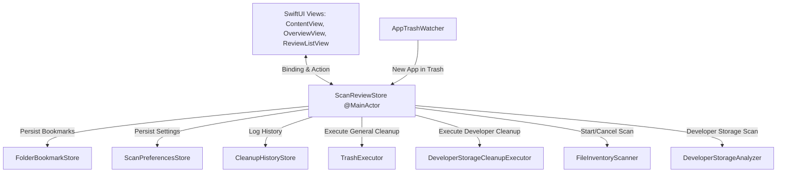
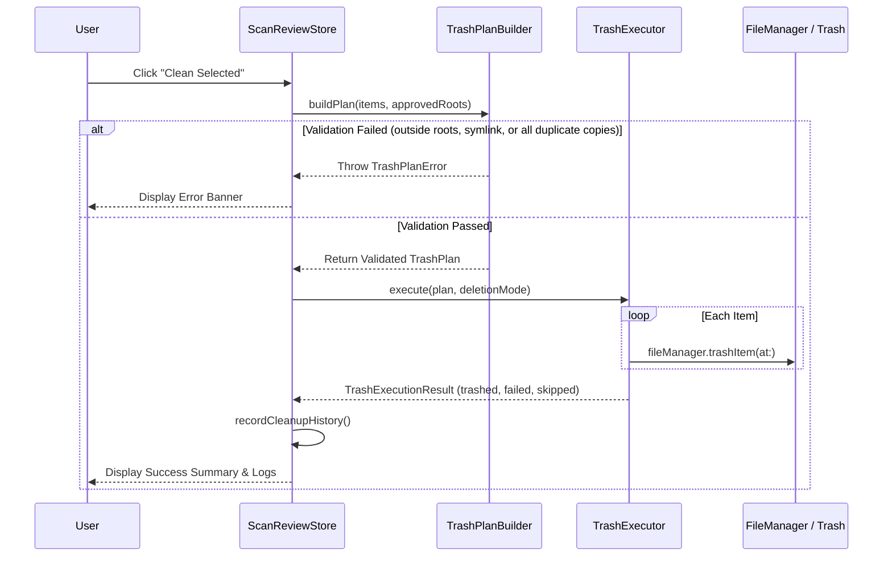

# LittleTidy — Architecture Deep Dive

This document details the architectural design, component interactions, state machine, and data models of **LittleTidy**.

---

## 1. High-Level Architectural Layering

LittleTidy is strictly partitioned into two primary layers to guarantee testability, maintainability, and clean separation of concerns:

```
+-------------------------------------------------------------------------+
|                              LittleTidy                                 |
|               (macOS App: SwiftUI + AppKit + Sparkle)                   |
|                                                                         |
|  +-------------------------------------------------------------------+  |
|  |                           Presentation                            |  |
|  |  SidebarView  DetailView  OverviewView  ReviewListView  ...       |  |
|  +---------------------------------+---------------------------------+  |
|                                    |                                    |
|  +---------------------------------v---------------------------------+  |
|  |                            State Layer                            |  |
|  |  ScanReviewStore (@MainActor)                                     |  |
|  |  ├── ScanPreferencesStore (UserDefaults)                          |  |
|  |  ├── CleanupHistoryStore (UserDefaults)                           |  |
|  |  └── FolderBookmarkStore (Security-Scoped Bookmarks)              |  |
|  +---------------------------------+---------------------------------+  |
+------------------------------------|------------------------------------+
                                     | Imports
+------------------------------------v------------------------------------+
|                            LittleTidyCore                               |
|                  (Pure Swift Engine & Execution Layer)                  |
|                                                                         |
|  +---------------------+  +---------------------+  +-----------------+  |
|  |      Scanners       |  |      Analyzers      |  |   Watchers      |  |
|  | FileInventoryScanner|  | DeveloperStorage    |  | AppTrashWatcher |  |
|  |                     |  | Duplicate / Large   |  |                 |  |
|  |                     |  | Cache / AppUsage    |  |                 |  |
|  +----------+----------+  +----------+----------+  +--------+--------+  |
|             |                        |                      |           |
|  +----------v------------------------v----------------------v--------+  |
|  |                       Policies & Data Models                      |  |
|  |  DeveloperStoragePolicy, FullDiskAccess, ScanOptions, Models      |  |
|  +-----------------------------------+-------------------------------+  |
|                                      |                                  |
|  +-----------------------------------v-------------------------------+  |
|  |                          Execution Engine                         |  |
|  |  TrashPlanBuilder, TrashExecutor, DevStorageCleanupExecutor       |  |
|  |  DeveloperToolActivityChecker, DeveloperToolCommandClient         |  |
|  +-------------------------------------------------------------------+  |
+-------------------------------------------------------------------------+
```

---

## 2. The Scanning Pipeline

Scanning arbitrary filesystems on macOS requires handling permission errors, hidden files, iCloud placeholder files, symlinks, and massive directory hierarchies without blocking the main UI.

### 2.1 FileInventoryScanner
[`FileInventoryScanner`](file:///Users/federicotrevisani/LittleTidy/Sources/LittleTidyCore/Analyzers/FileInventoryScanner.swift) uses `FileManager.DirectoryEnumerator` with `options: [.skipsPackageDescendants]`. It runs on a global background queue and yields an asynchronous stream of events:

```swift
public func scan(request: ScanRequest) -> AsyncThrowingStream<ScanEvent, Error>
```

#### Stream Events (`ScanEvent`)
- `.started(rootCount)`: Scan initiated across $N$ roots.
- `.rootStarted(url, index, total)`: Beginning traversal of a specific root.
- `.indexedFile(FileRecord)`: Emitted for every eligible regular file.
- `.skipped(URL, reason)`: Emitted when a directory or file is filtered out.
- `.permissionDenied(URL, Error)`: Handled gracefully via the enumerator's error handler without terminating the scan.
- `.progress(ScanProgress)`: Throttled status updates (emitted every 100 scanned files).
- `.completed(ScanSummary)`: Final counts of files, bytes, skips, and errors.

#### Filtering Rules
1. **System Paths Blocked by Default**: If `!options.includeSystemFolders`, paths starting with `/System`, `/Library`, `/private`, `/usr`, `/bin`, or `/sbin` are rejected.
2. **Hidden Files**: Skipped unless `options.includeHiddenFiles` is true.
3. **Symbolic Links**: Skipped unless `options.followSymbolicLinks` is true.
4. **iCloud Ubiquitous Items**: Files marked `isUbiquitousItem == true` whose download status is NOT `.current` (i.e. evicted/placeholder files) are skipped so the scanner never triggers accidental network downloads.

---

## 3. The Analysis Layer

Once `FileRecord` items are collected, [`CleanupAnalysis`](file:///Users/federicotrevisani/LittleTidy/Sources/LittleTidyCore/Analyzers/CleanupAnalysis.swift) dispatches them to specialized analyzers:

### 3.1 Duplicate Detection (`DuplicateAnalyzer`)
To find duplicates efficiently without hashing gigabytes of unique files, [`DuplicateAnalyzer`](file:///Users/federicotrevisani/LittleTidy/Sources/LittleTidyCore/Analyzers/DuplicateAnalyzer.swift) uses a 3-tier filter:
1. **Size Partitioning**: Only files sharing identical file sizes (and $\ge$ `minimumDuplicateSize`) are grouped.
2. **Sparse 64 KB Fingerprint**: Computes SHA-256 over 3 strategic 64 KB slices:
   - Beginning of file (offset $0$).
   - Middle of file (offset $\max(0, \text{size}/2 - 32\text{KB})$).
   - End of file (offset $\max(0, \text{size} - 64\text{KB})$).
3. **Full SHA-256 Hash**: Only candidates whose quick fingerprints match are subjected to streaming 1 MB chunked SHA-256 hashing.

#### Keep Strategy Heuristics
When a duplicate group is discovered, LittleTidy picks one recommended file to keep using configurable strategies (`DuplicateKeepStrategy`):
- `smart`: Assigns penalty points to files in `~/Downloads` (+100), hidden files (+50), deep directory nesting (+path length), and older files. The copy with the lowest score is recommended to keep.
- `oldest`: Keeps the oldest file by creation/modification date.
- `newest`: Keeps the most recent file.
- `preferNonDownloads`: Strongly avoids keeping files located in `~/Downloads`.
- `shortestPath`: Keeps the file with the most concise filesystem path.

### 3.2 Large File Ranking (`LargeFileAnalyzer`)
[`LargeFileAnalyzer`](file:///Users/federicotrevisani/LittleTidy/Sources/LittleTidyCore/Analyzers/LargeFileAnalyzer.swift) selects files exceeding `largeFileThreshold` (default: 500 MB).
- **Package Exclusion**: Package directories such as `.photoslibrary`, `.musiclibrary`, `.xcodeproj`, `.xcworkspace`, `.vmwarevm`, and `.pvm` are filtered out.
- **Scoring**: Computes a priority score based on size (+1 per 100 MB, max 100), age (+1 per month of inactivity, max 40), location in `Downloads` (+25), and installer/media file extensions (`dmg`, `pkg`, `iso`, `mov`, `mp4`, `mkv`) (+20).

### 3.3 Cache Detection (`CacheAnalyzer`)
[`CacheAnalyzer`](file:///Users/federicotrevisani/LittleTidy/Sources/LittleTidyCore/Analyzers/CacheAnalyzer.swift) discovers regenerable cache directories:
- Direct subfolders of `~/Library/Caches`.
- Sandboxed application caches at `~/Library/Containers/*/Data/Library/Caches`.
- Developer tooling caches (`.npm`, `.yarn`, `.cache/pip`, `.cache/uv`, `.cargo`, `pnpm`, `bun`, `gradle`, `conda`, `go`).
- Excludes symlinks and maps bundle identifiers to human-readable names.

### 3.4 Unused App Detection (`AppUsageAnalyzer`)
[`AppUsageAnalyzer`](file:///Users/federicotrevisani/LittleTidy/Sources/LittleTidyCore/Analyzers/AppUsageAnalyzer.swift) traverses `/Applications` and `~/Applications`:
- Extracts bundle metadata (`CFBundleIdentifier`, `CFBundleDisplayName`, version).
- Queries Spotlight last-opened metadata using the CoreServices metadata API (`kMDItemLastUsedDate`). Falls back to filesystem access/modification dates if Spotlight metadata is missing.
- Classifies apps:
  - `probablyUnused`: $\ge$ 180 days since last opened.
  - `possiblyUnused`: $\ge$ 90 days since last opened.
  - `recentlyUsed`: $< 90$ days.
- Locates related app leftovers by exact bundle ID.

### 3.5 Storage Map Aggregator (`FolderUsageAnalyzer`)
[`FolderUsageAnalyzer`](file:///Users/federicotrevisani/LittleTidy/Sources/LittleTidyCore/Analyzers/FolderUsageAnalyzer.swift) takes the existing stream of `FileRecord`s and calculates total byte usage for the first-level folders under each scanned root. This powers the squarified treemap in `StorageMapView` without any secondary disk traversal.

---

## 4. State Management & Architecture

State is coordinated by [`ScanReviewStore`](file:///Users/federicotrevisani/LittleTidy/Sources/LittleTidy/State/ScanReviewStore.swift), an `@ObservableObject` locked to `@MainActor`.



### 4.1 Persistent Stores
1. **[`ScanPreferencesStore`](file:///Users/federicotrevisani/LittleTidy/Sources/LittleTidy/State/ScanPreferencesStore.swift)**:
   - Serializes scan options, thresholds, toggles (`includeHiddenFiles`, `includeSystemFolders`, `includeCaches`, `includeRelatedAppData`, `enableTrashWatcher`, `deletionMode`, `allowPermanentDeletion`) to `UserDefaults`.
2. **[`FolderBookmarkStore`](file:///Users/federicotrevisani/LittleTidy/Sources/LittleTidy/State/FolderBookmarkStore.swift)**:
   - Stores security-scoped bookmarks for user-selected folders (`URL.bookmarkData(options: .withSecurityScope)`), ensuring permissions survive app relaunch.
3. **[`CleanupHistoryStore`](file:///Users/federicotrevisani/LittleTidy/Sources/LittleTidy/State/CleanupHistoryStore.swift)**:
   - Maintains an append-only JSON list of completed cleanup operations in `UserDefaults` (`date`, `bytesFreed`, `trashedCount`, `failedCount`, and per-category breakdown).

---

## 5. UI Architecture & Design System

The application interface is structured using a `NavigationSplitView` with custom macOS Tahoe styling.

### 5.1 Navigation Structure (`SidebarSection`)
The sidebar is partitioned into three distinct groups:
1. **System**:
   - `Overview`: Global summary, scan status, readiness check, quick actions.
   - `Storage Map`: Squarified treemap visualizer.
2. **Cleanup**:
   - `Developer Storage`: Specialist view for Xcode, Simulators, XCTest, and AI tooling.
   - `Application Caches`: Per-app and dev-tool regenerable caches.
   - `Duplicate Files`: Grouped duplicate copies with keep badges.
   - `Large Files`: Files ranked by size, age, and type.
   - `Applications`: Unused and old apps with deep leftover inspection.
3. **Review**:
   - `Cleanup Plan`: Final confirmation before disk operations, risk analysis, and post-cleanup execution log.

### 5.2 Tahoe Design System
- **Colors ([`CleanerPalette.swift`](file:///Users/federicotrevisani/LittleTidy/Sources/LittleTidy/UIComponents/CleanerPalette.swift))**:
  - `Color.cleanerSuccess` (`nsColor: .systemGreen`)
  - `Color.cleanerWarning` (`nsColor: .systemOrange`)
  - `Color.cleanerInfo` (`nsColor: .systemBlue`)
  - `Color.cleanerDanger` (`nsColor: .systemRed`)
- **Surfaces ([`CleanerSurface.swift`](file:///Users/federicotrevisani/LittleTidy/Sources/LittleTidy/UIComponents/CleanerSurface.swift))**:
  - `.cleanerSurface(cornerRadius:)`: Standard card surface with subtle border stroke (`controlBackgroundColor` + separator).
  - `.cleanerSubtleSurface(cornerRadius:)`: Quaternary label background for badges and secondary elements.
  - `.cleanerInteractiveSurface(cornerRadius:)`: Elevated border treatment for clickable cards.

---

## 6. Execution Safety & Trash Plans

Disk modifications never occur arbitrarily in view code. They are staged through `TrashPlan` or `DeveloperStorageCleanupExecutor`.



### 6.1 `TrashPlanBuilder` Rules
Before `TrashExecutor` runs, [`TrashPlanBuilder`](file:///Users/federicotrevisani/LittleTidy/Sources/LittleTidyCore/Execution/TrashPlanBuilder.swift) verifies:
1. Plan is non-empty (`TrashPlanError.emptyPlan`).
2. Every item path is strictly inside one of the approved `scanRoots` (`TrashPlanError.outsideApprovedRoots`).
3. No item is inside `/System/Applications/` or `/System/` (`TrashPlanError.systemAppBlocked`).
4. No item is a symbolic link (`TrashPlanError.symbolicLinkBlocked`).
5. For duplicate groups, at least one copy in the group is excluded from deletion (`TrashPlanError.duplicateGroupWouldRemoveAllCopies`).

### 6.2 `DeveloperStorageCleanupExecutor`
For developer storage, execution is handled by [`DeveloperStorageCleanupExecutor`](file:///Users/federicotrevisani/LittleTidy/Sources/LittleTidyCore/Execution/DeveloperStorageCleanupExecutor.swift):
1. Immediately checks if Xcode is active (`DeveloperToolActivityChecker`). If running, halts the entire batch fail-closed.
2. If the item's mechanism is `.trash`, moves it to Trash via `FileManager.trashItem`.
3. If the item's mechanism is `.simctl`, queries `simctl list devices --json` to verify the device is currently shutdown, then calls `xcrun simctl delete <UDID>`.
4. If the item is `.xcodeManaged` (Simulator runtime), checks that no booted device depends on it, then runs `xcrun simctl runtime delete <ID>`.
