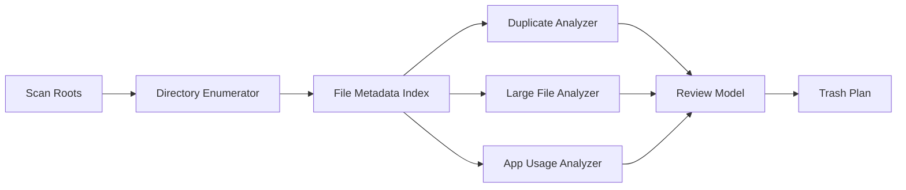

# Mac Disk Cleaner Logic Spec

## Product Scope

The app is a macOS disk maintenance tool focused on three high-value cleanup workflows:

1. Duplicate files
2. Large files
3. Unused apps

The first version should avoid aggressive "system cleaner" behavior. It should not delete caches, logs, language files, system files, or app internals until the core trust model is strong. The product should help users safely identify reclaimable space, preview what will happen, and move items to Trash instead of permanently deleting them.

## Recommended Stack

Use Swift for the macOS app.

Reasons:

- Native access to file metadata, security-scoped bookmarks, app bundles, Launch Services, Spotlight metadata, and macOS privacy permissions.
- SwiftUI is sufficient for the app UI, while AppKit can be used narrowly for Finder integration, file previews, and advanced table behavior.
- The app can ship as a normal `.app` without a helper service for the initial version.

The scanning engine should be written as a separate Swift module so it can be tested without the UI.

## Core Principles

- Never scan hidden/system areas by default without explicit user opt-in.
- Never auto-select originals, apps, or ambiguous files for removal.
- Prefer moving files to Trash via `FileManager.trashItem(at:resultingItemURL:)`.
- Every deletion candidate must have a reason, size, path, confidence level, and reversible action.
- Scans must be cancellable, resumable where possible, and memory bounded.
- The UI should never block while scanning.

## Permissions Model

macOS privacy rules require explicit access to many user folders. The app should use a staged permission flow:

1. Basic mode: scan user-selected folders through an `NSOpenPanel`.
2. Enhanced mode: ask the user to grant Full Disk Access in System Settings.
3. Optional folder bookmarks: persist security-scoped bookmarks for folders the user approved.

Initial scan targets:

- `~/Downloads`
- `~/Desktop`
- `~/Documents`
- `~/Movies`
- `~/Music`
- `~/Pictures`
- User-selected external folders

Excluded by default:

- `/System`
- `/Library`
- `/private`
- `/usr`
- `/bin`
- `/sbin`
- App bundle internals
- iCloud placeholder files that are not fully downloaded
- Time Machine backups
- Package manager internals unless explicitly supported later

## Data Model

```swift
struct FileRecord: Hashable, Codable {
    let id: UUID
    let url: URL
    let fileSize: Int64
    let allocatedSize: Int64?
    let creationDate: Date?
    let modificationDate: Date?
    let lastAccessDate: Date?
    let contentType: String?
    let isHidden: Bool
    let volumeIdentifier: String?
}

struct DuplicateGroup: Codable {
    let id: UUID
    let contentHash: String
    let files: [FileRecord]
    let reclaimableBytes: Int64
    let confidence: Confidence
    let recommendedKeep: FileRecord?
}

struct LargeFileCandidate: Codable {
    let file: FileRecord
    let reason: String
    let confidence: Confidence
}

struct AppUsageRecord: Codable {
    let appURL: URL
    let bundleIdentifier: String?
    let displayName: String
    let version: String?
    let appSizeBytes: Int64
    let lastOpenedDate: Date?
    let installDate: Date?
    let relatedDataEstimateBytes: Int64?
    let confidence: Confidence
}

enum Confidence: String, Codable {
    case high
    case medium
    case low
}
```

## Scan Pipeline

The engine should run a common file inventory pipeline, then feed specialized analyzers.



## File Inventory Logic

Use `FileManager.enumerator(at:includingPropertiesForKeys:options:errorHandler:)` with resource keys:

- `.isRegularFileKey`
- `.isDirectoryKey`
- `.isHiddenKey`
- `.fileSizeKey`
- `.totalFileAllocatedSizeKey`
- `.creationDateKey`
- `.contentModificationDateKey`
- `.contentAccessDateKey`
- `.typeIdentifierKey`
- `.volumeIdentifierKey`
- `.isUbiquitousItemKey`
- `.ubiquitousItemDownloadingStatusKey`

Inventory rules:

- Skip unreadable directories and report them as permission gaps.
- Skip symbolic links by default to avoid cycles and surprising cross-volume scans.
- Skip files smaller than a configurable duplicate threshold, default `1 MB`.
- Track scanned bytes, file count, skipped count, and permission errors.
- Emit incremental progress events.

Suggested engine API:

```swift
protocol DiskScanner {
    func scan(request: ScanRequest) -> AsyncThrowingStream<ScanEvent, Error>
}

struct ScanRequest {
    let roots: [URL]
    let options: ScanOptions
}

struct ScanOptions {
    var includeHiddenFiles: Bool = false
    var includeSystemFolders: Bool = false
    var minimumDuplicateSize: Int64 = 1_000_000
    var largeFileThreshold: Int64 = 500_000_000
}
```

## Duplicate File Logic

Duplicate detection should use staged comparison to avoid hashing every byte unnecessarily.

Stages:

1. Group by file size.
2. Discard groups with only one file.
3. For each remaining group, compute a quick fingerprint:
   - first 64 KB
   - middle 64 KB
   - last 64 KB
4. Group by quick fingerprint.
5. For groups still containing more than one file, compute full cryptographic hash, preferably SHA-256.
6. Create duplicate groups only when size and full hash match.

Recommended keep heuristic:

- Prefer file outside `Downloads` over file inside `Downloads`.
- Prefer oldest creation date when paths look user-authored.
- Prefer file in shallow folder over deeply nested duplicate.
- Prefer non-hidden file.
- Never auto-select all files in a group.

Duplicate cleanup action:

- User must choose which copies to remove.
- Reclaimable space equals sum of selected duplicate copies, not including the kept file.
- Move selected files to Trash.

Confidence:

- `high`: same byte size and full SHA-256 hash.
- `medium`: reserved for future photo/audio perceptual duplicate detection.
- `low`: not used for deletion recommendations.

## Large File Logic

Large file detection is simpler but needs useful ranking.

Default threshold:

- `500 MB` for general files.
- Show a separate "Very Large" segment for files above `5 GB`.

Candidate enrichment:

- File size and allocated size.
- Last modified date.
- Last opened date when available.
- File kind.
- Parent folder.
- Whether the file is in Downloads, Movies, Desktop, or external volumes.

Ranking formula:

```text
score = sizeWeight + ageWeight + locationWeight + fileTypeWeight
```

Suggested weights:

- Larger files rank higher.
- Older untouched files rank higher.
- Files in Downloads rank higher.
- Disk images, archives, installers, and videos rank higher.

Do not mark as recommended removal:

- Photo libraries.
- Music libraries.
- Xcode projects.
- Virtual machines.
- App support databases.
- Files inside app bundles.

Cleanup action:

- Move selected files to Trash.
- For package-like folders such as `.photoslibrary`, show as a single item and require explicit confirmation.

## Unused App Logic

App detection should scan:

- `/Applications`
- `~/Applications`

Treat `.app` bundles as app records, not directories of files.

Metadata sources:

- `Info.plist`: bundle identifier, display name, version.
- Bundle size: recursively sum allocated size.
- Last opened date:
  - Prefer Spotlight metadata such as `kMDItemLastUsedDate` if available.
  - Fallback to bundle content modification dates with low confidence only.
- Install date:
  - Creation date or receipt data when available.

Unused app categories:

- Probably unused: not opened in 180+ days.
- Possibly unused: not opened in 90+ days.
- Unknown usage: no reliable last-opened date.

Do not recommend removal by default:

- Apple system apps.
- Apps under `/System/Applications`.
- Apps signed by Apple when removal is restricted.
- Developer tools such as Xcode unless the user opts into developer cleanup.
- Apps with active login items or background agents until the app can show related components clearly.

Related data detection can come later. For v1, uninstall should move only the `.app` bundle to Trash. A later "deep uninstall" mode can identify related files in:

- `~/Library/Application Support`
- `~/Library/Caches`
- `~/Library/Preferences`
- `~/Library/Containers`
- `~/Library/Group Containers`
- `~/Library/LaunchAgents`

Deep uninstall must be conservative and keyed by bundle identifier, team identifier, and explicit app metadata.

## Trash Plan

Before cleanup, build an immutable plan:

```swift
struct TrashPlan: Codable {
    let id: UUID
    let createdAt: Date
    let items: [TrashPlanItem]
    let totalBytes: Int64
}

struct TrashPlanItem: Codable {
    let sourceURL: URL
    let bytes: Int64
    let category: CleanupCategory
    let reason: String
}

enum CleanupCategory: String, Codable {
    case duplicate
    case largeFile
    case unusedApp
}
```

Execution rules:

- Revalidate that every file still exists before trashing.
- Recompute size for display if changed.
- Trash one item at a time and record result.
- Continue after non-fatal failures.
- Show a completion report with trashed, skipped, and failed items.

## Safety Rules

Hard blocks:

- Never delete files permanently in v1.
- Never remove files outside approved scan roots.
- Never remove the only file in a duplicate group.
- Never remove system apps.
- Never follow symlinks for deletion.
- Never remove related app data in v1.

Soft warnings:

- Cloud-synced folders.
- External drives.
- Package files.
- Apps not opened date unknown.
- Items larger than 50 GB.

## Testing Strategy

Unit tests:

- File size grouping.
- Quick fingerprint grouping.
- Full hash duplicate confirmation.
- Recommended keep heuristic.
- Large file ranking.
- App bundle metadata parsing.
- Trash plan validation.

Integration tests:

- Temporary directory scan with generated duplicates.
- Permission-denied folder handling.
- Symlink skip behavior.
- Cancellation during scan.

Manual tests:

- Scan Downloads and Desktop.
- Scan an external drive.
- Full Disk Access absent and present.
- Trash action with locked files.

## Implementation Milestones

1. Scanning engine module with file inventory.
2. Duplicate analyzer with staged hashing.
3. Large file analyzer.
4. App inventory and unused app classifier.
5. Trash plan builder and executor.
6. Minimal SwiftUI review UI.
7. Polished UI with scan progress, filters, previews, and cleanup report.

## Initial UI Direction

The UI should be operational and review-first, not decorative.

Primary screens:

- Overview: storage found by category, last scan, permission status.
- Scan: root selection, progress, cancellation, permission gaps.
- Review: segmented categories for duplicates, large files, unused apps.
- Cleanup plan: selected items, total reclaimable space, warnings.
- Results: trashed items, failures, next suggested scan.

The most important interaction is review confidence. Users should understand why each item is shown and what will happen when they clean it.
